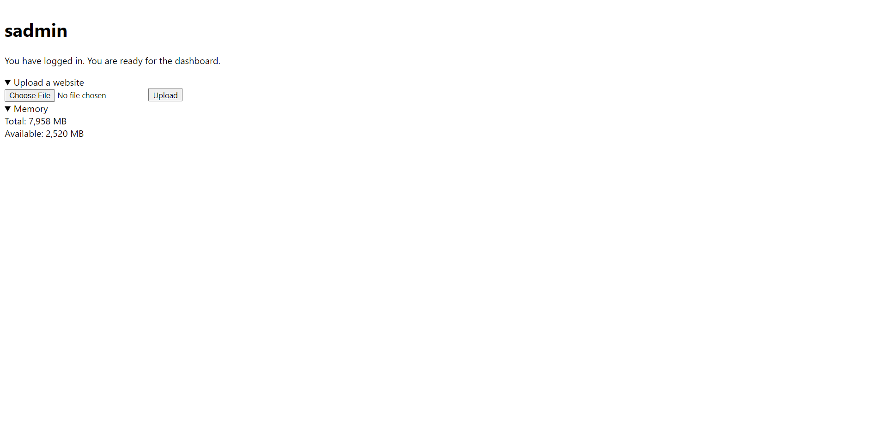

# sadmin

`sadmin` is a light-weight admin page. It's really simple. Just drag `sadmin` on to your website. And, the default password is `password`.

## Changing the password

In sadmin/password.php, after `?>`, put in your password. No newlines, just the password.

## Uploading a website

Upload your website as a ZIP file. Make sure that your files are in the root, not in a folder.

## Screenshots

